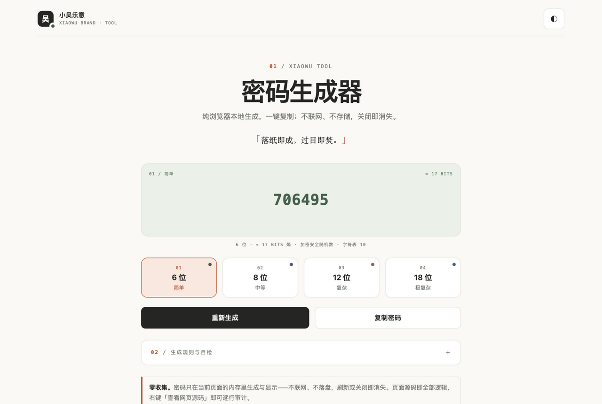

# 密码生成器（单文件 · 纯本地 · 可审计）

一个只有 `index.html` 一个文件的密码生成网页：无框架、无依赖、无网络请求、无任何存储。

**在线体验：<https://password-generator-5e7.pages.dev>**（Cloudflare Pages）



视觉风格遵循 [lovexw/xiaowu-brand-kit](https://github.com/lovexw/xiaowu-brand-kit)（MIT）的设计规范——「温润纸感，手作印刷」：纸白底 `#faf9f6`、墨色字 `#252623`、陶土橘 `#b9542b` 只做点缀、等宽编号贯穿全站、1px 细描边分隔、无投影无渐变，动效仅 transform（.18s、位移 ≤3px）。展示区按四档规格做「编号艺术区块」四色轮换（苔绿 / 藤紫 / 沙棕 / 雾蓝），深浅双主题整组 token 切换。

## 功能

| 档位 | 长度 | 字符表 | 规则 |
|---|---|---|---|
| 简单 | 6 位 | 10 个：纯数字 0-9（PIN 式） | 字符互不重复；相邻字符不连号 |
| 中等 | 8 位 | 55 个：大小写字母（去易混淆）+ 数字（去 0 1） | 字符互不重复；至少各含 1 个小写 / 大写 / 数字 |
| 复杂 | 12 位 | 75 个：完整大小写 + 数字 + 符号 `!@#$%^&*-_=+?` | 至少各含 1 个小写 / 大写 / 数字 / 符号 |
| 极复杂 | 18 位 | 同上 | 同上 |

支持一键复制（点"复制密码"按钮或直接点密码本身）、深浅主题切换、移动端自适应。

## 运行

直接双击打开 `index.html` 即可；或起个本地服务：

```bash
python3 -m http.server 8000
# 浏览器访问 http://localhost:8000
```

## 安全与隐私

- 密码只在浏览器内存中生成和显示，刷新或关闭页面即消失。
- 不发送任何网络请求（页面无任何外部资源），不写 Cookie / localStorage / IndexedDB。
- 随机数唯一来源是 `crypto.getRandomValues()`（操作系统级 CSPRNG）。
- 深浅主题刻意不持久化（刷新回浅色）——连主题偏好也不落盘，守住"零存储"承诺。

## 审计指南

1. **读源码**：整个页面就是 `index.html`，右键"查看网页源码"即可通读，关键逻辑集中在脚本区的"随机数核心"注释块。
2. **验证零请求**：打开开发者工具 Network 面板刷新页面，应看不到任何请求。
3. **验证随机源**：脚本中所有随机性都经过 `randomInt()`（拒绝采样消除取模偏差）和 `sampleDistinct()`（Fisher–Yates 部分洗牌），可逐行核对。
4. **批量自检**：在控制台运行 `__audit(5000)`，会对四档规格各批量生成 5000 条并校验全部规则，返回的违规计数应全部为 0。

## 品牌合规自查（对照 DESIGN.md 硬性要求）

- 双主题：浅色默认，`html[data-theme='dark']` 整组切换；因零存储承诺不做持久化，无闪烁问题。
- 编号系统：节眉题 `01 /`、`02 /`，展示区角落与规则列表均为两位补零等宽编号。
- 动效：仅 transform（.18s ease），位移 ≤3px；`prefers-reduced-motion` 全部禁用。
- 焦点态：`outline: 3px solid var(--xw-accent); outline-offset: 5px`。
- 禁项：无渐变、无投影、无外部请求、图标只用字符（◐ ＋ － ✓ ↗）、陶土橘不做大面积色块、主按钮为墨底纸字、等宽字体只用于编号 / 标签 / 密码展示。
