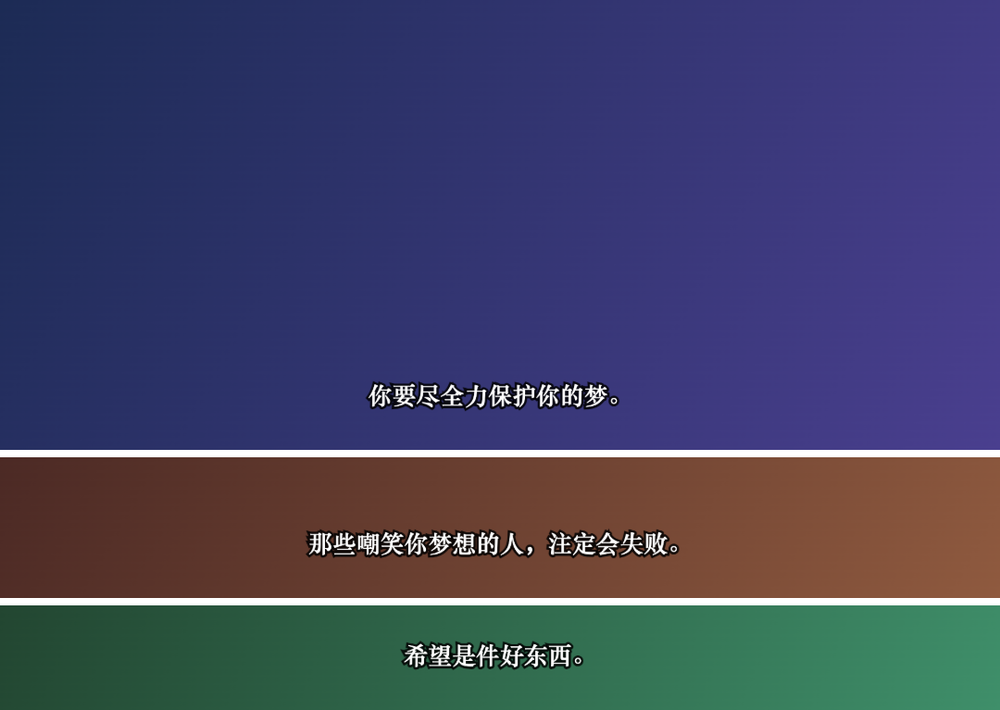

# 🎬 台词拼图 (Subtitle Collage)

**电影台词截图拼图工具** —— 把多张电影台词截图拼成一张精美的长图。第一张默认完整展示（主图，也可裁切），其余自动只保留底部台词区域，一键拼接导出。

🌐 **在线使用：[pintu.xiaowuleyi.com](https://pintu.xiaowuleyi.com)** （备用地址：[subtitle-collage.pages.dev](https://subtitle-collage.pages.dev)）

[](LICENSE)
[](https://pages.cloudflare.com/)
[](#技术实现)

## 预览



> 上图即为本工具的实际输出：首图完整保留（已裁掉顶部片头），其余截图自动只保留台词条。

## ✨ 功能特性

- **批量上传**：一次最多 20 张，支持多选、拖拽、剪贴板粘贴（Ctrl/Cmd + V）
- **智能裁剪**：第一张默认完整显示，其余自动只保留底部台词区域（默认 25%）
- **主图裁切**：主图同样可裁，去掉片头/黑边/多余画面
- **逐张微调**：滑杆控制裁掉顶部/底部，或直接**上下拖动画面**；快捷预设（只留 15% / 25% / 35%）
- **模式记忆**：每张图的「全图 / 台词区」两种模式各自记忆裁剪值，来回切换不丢失
- **批量调整**：一键把当前裁剪方案统一应用到全部台词图
- **排序管理**：上移 / 下移调整顺序，删除后 5 秒内可撤销
- **导出设置**：输出宽度（720 / 1080 / 1440）、图片间距、背景颜色（含自定义）、PNG / JPG 格式
- **iPhone 一键存相册**：调用 Web Share API 调起系统分享面板，两步存入相册；失败自动回退下载
- **超长图保护**：超出浏览器画布上限时自动等比缩放导出

## 🚀 快速开始

无需安装，直接打开在线版：**[pintu.xiaowuleyi.com](https://pintu.xiaowuleyi.com)**

或本地运行（纯静态单文件，二选一）：

```bash
# 方式一：直接双击 index.html 用浏览器打开

# 方式二：起个本地服务
python3 -m http.server 8899
# 访问 http://localhost:8899
```

## 📖 使用指南

1. **选图** —— 一次选中多张电影台词截图（多选 / 拖拽 / 粘贴均可）
2. **调整** —— 第一张默认完整显示，其余自动只留台词区域；点击卡片逐张微调，或用批量调整统一处理
3. **生成** —— 一键拼接为一张长图，下载保存；iPhone 端点「保存到相册」两步入相册

### 💡 iPhone 存相册小技巧

> 苹果限制任何网站都无法静默写入相册，本工具已做到最顺路径：
> 生成后点「📱 保存到相册」→ 系统分享面板 → 点「存储图像」，两步完成。
> 建议在 Safari 里「添加到主屏幕」，即可获得全屏类 App 体验。

## 🛠 技术实现

| 项目 | 说明 |
|------|------|
| 架构 | 单文件 `index.html`，原生 HTML / CSS / JS，**零依赖、零构建** |
| 拼接 | Canvas 2D 按序绘制导出，支持 PNG / JPG |
| 保存相册 | Web Share API Level 2（iOS 15+ / Android），失败自动回退下载 |
| 隐私 | **纯本地处理**：图片不出浏览器，无后端、无统计、无追踪 |

## ☁️ 部署

已部署在 Cloudflare Pages，`main` 分支 push 后自动构建发布。

```bash
# 手动部署（备用）
wrangler pages deploy . --project-name subtitle-collage
```

## 🤝 参与贡献

欢迎 Issue / PR！开发就是改 `index.html` 一个文件，本地打开即所见即所得。

## 📄 License

[MIT](LICENSE) © 2026
